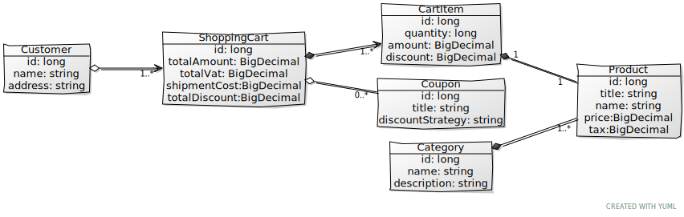

# Gateway Manager UI and backend
This is a sample application to demonstrate shopping cart data model.


## Prerequisites

- [x] JDK 8 or later 
- [x] Apache Maven 3.5 or later 
- [x] git client

## Class diagram


* A customer can have zero or one shopping carts.
* A customer can add one or more of each different products to each shopping cart.
* Every product must have a title, name, price and tax.
* A shopping cart has a total amount, total VAT and shipment costs.


## how to run this application

1. clone this repository using git command or alternatively , you may be able to download ZIP archive and extract it

```bash
git clone https://github.com/melanj/shopping-cart.git
```


## how to see coverage

Tests can be run using following maven command and test reports are available at 'target/site/jacoco/index.html'
most scenarios are covered by integration tests and few unit tests also available.

```bash
mvn clean test jacoco:report
```
